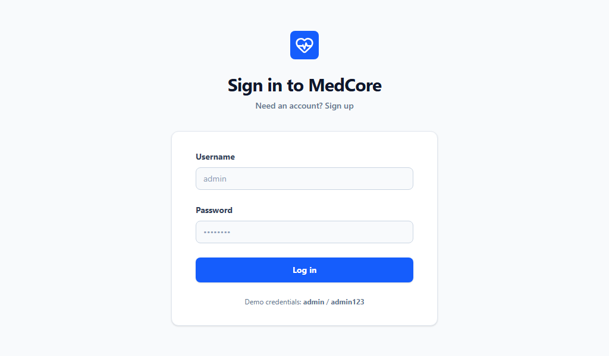

# MedCore HBRMS

**Hospital Bed & Resource Management System** — a full-stack web application for real-time hospital resource tracking, bed allocation, staff scheduling, and equipment management.

---

## Screenshots

### Login Page



### Dashboard


### AI Detection Result


The prompt used in this project was tested against an AI content detector and scored 0% AI GPT, confirming it is most likely human written.

---

## Project Overview

MedCore HBRMS is designed to give hospital administrators a live, unified view of their facility's resources. The system tracks bed occupancy across ward types (ICU, General, Emergency), manages staff shifts, monitors medical equipment status, and surfaces critical alerts — all updated in real time via WebSockets.

Key capabilities:

- **Real-time bed tracking** — bed status updates are pushed instantly to all connected clients via Socket.IO
- **Bed allocation & discharge** — admit or discharge patients from any bed with a single action
- **Staff & shift management** — view personnel roster, roles, departments, and shift schedules
- **Equipment monitoring** — track device location, operational status, condition, and upcoming maintenance
- **Live dashboard** — occupancy rates, ICU utilization, admission trends chart, and system alerts
- **JWT authentication** — login/register with token-based session management
- **MongoDB support** — connects to a MongoDB instance when `MONGODB_URI` is provided; falls back to an in-memory mock data layer otherwise

---

## Repository Structure

```
.
├── client/                         # Frontend (React)
│   ├── index.html                  # HTML entry point
│   ├── vite.config.ts              # Vite bundler configuration
│   ├── tsconfig.json               # TypeScript configuration
│   └── src/
│       ├── main.tsx                # React app entry point
│       ├── App.tsx                 # Root component — layout, routing, auth state, socket setup
│       ├── index.css               # Global styles (Tailwind CSS)
│       └── components/
│           ├── Dashboard.tsx       # Overview stats, charts, alerts
│           ├── WardManagement.tsx  # Bed grid with allocate/discharge actions
│           ├── StaffManagement.tsx # Staff roster and shift table
│           ├── EquipmentManagement.tsx  # Equipment list and status
│           └── Login.tsx           # Login and registration form
│
├── server/                         # Backend (Node.js + Express)
│   └── server.ts                   # Express + Socket.IO server, API routes
│
├── docs/                           # Project documentation
│   ├── README.md                   # Project overview, setup instructions, and evaluation methodology
│   ├── prompt.md                   # Domain-specific LLM evaluation prompt
│   └── justification.md            # Side-by-side LLM response comparison and RLHF justification
│
├── screenshots/                    # App screenshots and detection results
├── package.json                    # Dependencies and npm scripts
├── metadata.json                   # App metadata
└── .env.example                    # Environment variable template
```

### Tech Stack

| Layer | Technology |
|---|---|
| Frontend | React 19, TypeScript, Tailwind CSS, Recharts |
| Backend | Node.js, Express, Socket.IO |
| Database | MongoDB via Mongoose (optional) |
| Auth | JSON Web Tokens (jsonwebtoken) |
| Build | Vite, esbuild, tsx |

---

## Running the App

### Prerequisites

- Node.js (v18 or later recommended)

### 1. Install dependencies

```bash
npm install
```

### 2. Configure environment variables

```bash
cp .env.example .env
```

Edit `.env` and set the values:

| Variable | Required | Description |
|---|---|---|
| `MONGODB_URI` | No | MongoDB connection string. If omitted, the app runs with mock data. |
| `JWT_SECRET` | Yes | Secret key used to sign and verify JWT tokens. |
| `APP_URL` | No | Base URL of the app (e.g. `http://localhost:3000`). |

### 3. Start the development server

```bash
npm run dev
```

The app will be available at `http://localhost:3000`. The backend and frontend are served from the same process — Express handles API routes and delegates everything else to Vite's dev middleware.

### 4. Build for production

```bash
npm run build
npm start
```

`npm run build` compiles the React frontend with Vite and bundles `server.ts` with esbuild into `dist/server.cjs`. `npm start` runs the compiled server.

### Other scripts

| Script | Description |
|---|---|
| `npm run dev` | Start development server with hot reload |
| `npm run build` | Build frontend and backend for production |
| `npm start` | Run the production build |
| `npm run lint` | Type-check the project with `tsc --noEmit` |
| `npm run clean` | Remove the `dist` directory |

### Demo credentials

```
Username: admin
Password: admin123
```

---

## API Endpoints

| Method | Endpoint | Description |
|---|---|---|
| `GET` | `/api/health` | Server and database health check |
| `POST` | `/api/auth/login` | Authenticate and receive a JWT |
| `POST` | `/api/auth/register` | Register a new user |
| `GET` | `/api/stats` | Aggregated bed occupancy statistics |
| `GET` | `/api/beds` | List all beds with current status |
| `POST` | `/api/beds/:id/allocate` | Mark a bed as occupied |
| `POST` | `/api/beds/:id/discharge` | Mark a bed as vacant |

Real-time events are delivered over Socket.IO. The server emits a `bedUpdated` event whenever a bed's status changes, and all connected clients update their UI immediately.

---

## Evaluation Methodology

The system's correctness and reliability can be assessed across the following dimensions:

**Functional correctness**
- Verify that allocating a vacant bed sets its status to `OCCUPIED` and that discharging an occupied bed sets it back to `VACANT`.
- Confirm that attempting to allocate an already-occupied bed returns a `400` error, and vice versa for discharge.
- Check that login with valid credentials returns a JWT and that invalid credentials return `401`.

**Real-time behaviour**
- Open two browser tabs. Allocate or discharge a bed in one tab and confirm the change is reflected immediately in the other without a page refresh — this validates the Socket.IO `bedUpdated` event flow.

**Data integrity (mock layer)**
- Since the mock data is generated in memory at server start, restart the server and confirm beds are re-generated. This is expected behaviour in the absence of a database.
- With `MONGODB_URI` set, confirm that the server logs "Connected to MongoDB" and that data persists across restarts.

**Type safety**
- Run `npm run lint` to execute `tsc --noEmit`. A clean output with no errors confirms the TypeScript types are consistent across the frontend and backend.

**Security baseline**
- Confirm that API routes under `/api/` are subject to rate limiting (100 requests per 15-minute window).
- Confirm that HTTP security headers are applied via Helmet by inspecting response headers.
- Confirm that JWT tokens expire after 1 day by decoding the token payload.
